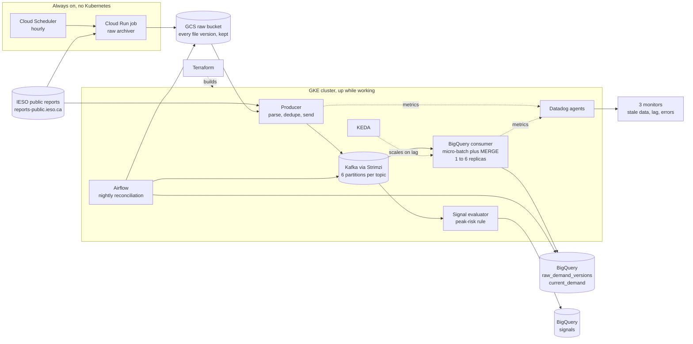
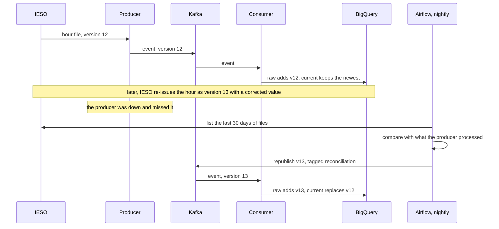
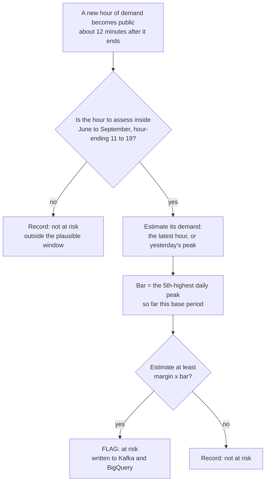
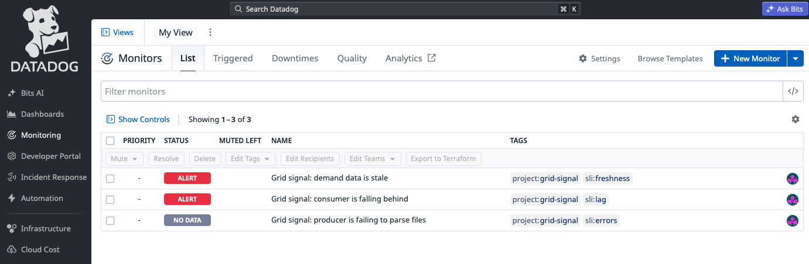
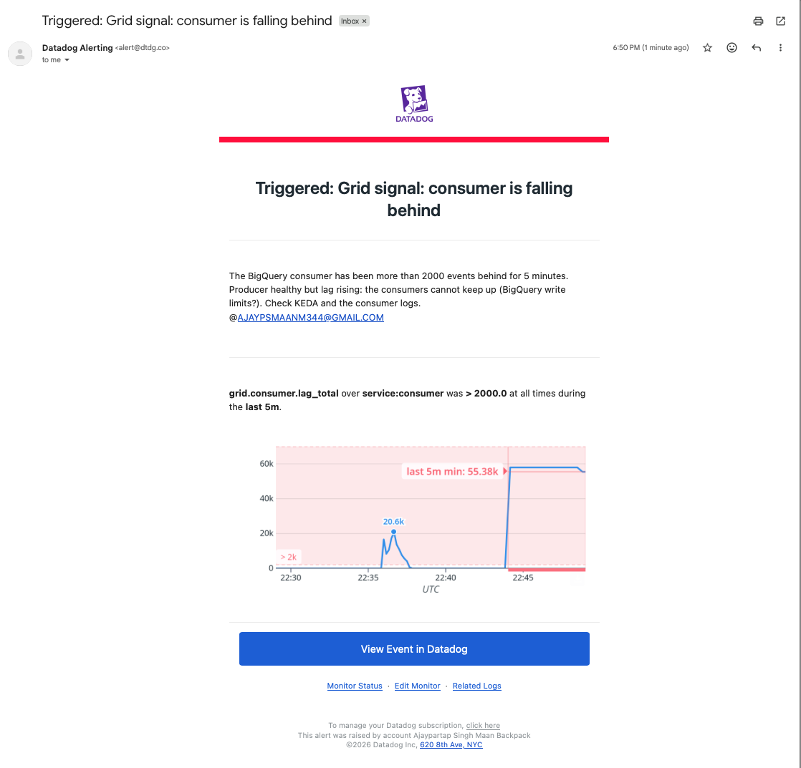

# Ontario Grid Signal

A streaming data pipeline and a peak-demand signal for Ontario's electricity grid, built end to end as a learning project: Terraform, Kubernetes, Kafka, BigQuery, Airflow, KEDA and Datadog, with an honest backtest of the signal itself.

## The problem in 60 seconds

Large Ontario electricity customers ("Class A" under the Industrial Conservation Initiative) pay according to their share of demand during the **five highest-demand days of the year** (1 May to 30 April). A factory that cuts its load during those hours saves a lot, but nobody knows which hours they are until the year is over. This project watches IESO's public demand data and flags hours that look like they could become one of those five, then checks, on past years, how many of IESO's real peaks it would have caught and how many alert-hours that cost.

## Try it in 30 seconds (no cloud account needed)

Needs [uv](https://docs.astral.sh/uv/). The first run downloads Python packages.

```bash
make test                                  # 114 tests, about 35 seconds
make backtest                              # the walk-forward backtest, about 3 seconds
make signals-replay DAY=2025-06-24         # what the live rule would have flagged around a real peak day
```

## How it works



**Two ideas run through all of it.** First, *desired state versus actual state, reconciled in a loop*: Terraform diffs your files against the cloud, Kubernetes controllers diff specs against pods, and the nightly Airflow job diffs what IESO has published against what was ingested. Second, *every value has a version*: IESO re-issues files, so the warehouse keeps every version (`raw_demand_versions`) and the latest (`current_demand`), and replaying history rebuilds both identically.

### A value that changes, and how the pipeline catches it



### When the signal flags an hour



The live evaluator and the backtest call the **same function**, with the window and margins the backtest chose from 2022 and 2023. A test checks that every live decision equals the backtest's.

## Results (all measured, with dates in [docs/results.md](docs/results.md))

**The signal.** Held-out base periods 2024 and 2025 (10 peaks: 5 derived, 5 confirmed by IESO). Full method and limits: [docs/validation.md](docs/validation.md).

| Variant | Notice | Peaks caught | Alert-hours (2 years) | Caught by chance, same hours |
|---|---|---|---|---|
| Perfect knowledge (a ceiling) | none | 10 / 10 | 241 | 1.1 |
| Latest published hour | about 45 min | 10 / 10 | 245 | 1.1 |
| Two-hours-stale hour | about 2 h 45 min | 7 / 10 | 122 | 0.6 |
| Yesterday's peak | about 16 h | 8 / 10 | 441 | 2.0 |

With only 10 peaks, and peaks that cluster on consecutive hot days, read these as "clearly better than chance", not as a hit rate.

**Autoscaling.** Rewinding the BigQuery consumer to the start of Kafka and timing the catch-up on 57,900 events. Report: [docs/load-test.md](docs/load-test.md).

| | Time | Throughput |
|---|---|---|
| 1 replica | 18 min 20 s | 53 events/s |
| KEDA, 1 to 6 replicas | **3 min 12 s** | **302 events/s** |


Autoscaling made the drain **5.7 times faster**, climbed to 6 replicas within 45 seconds, and was back to 1 replica about 4 minutes after the backlog cleared.

**Reconciliation.** The nightly Airflow job ran green on 4 days (3,000 to 4,000 files listed each, none missed). In a seeded test, one finished hour was removed from the producer's memory and from BigQuery; the job found the 12 files, resent them, confirmed they landed, and left both tables identical to before (same row counts and checksums).

**Alerting.** Three Datadog monitors (stale data, consumer lag, producer errors), defined as code. Each was triggered on purpose. The stale-data and lag monitors fired:





The lag alert in that email was **false**, and testing it is what exposed the bug: after a scale-in, my lag gauge counted partitions the consumer had not yet read from as entirely unread, while Kafka's own number was 0. It now falls back to committed offsets, with a test that reproduces it.

## Why these tools (and the honest answer to "isn't that overkill?")

| Tool | Why | The honest poke |
|---|---|---|
| Terraform | The environment is rebuilt every session, so it has to be reproducible from code | A rebuild takes about 10 minutes. `destroy` leaves nothing behind (an orphan check proves it). |
| GKE | Hosts the long-running, stateful pieces (Kafka, Airflow) and the scalable consumers | Cloud Run is used where it fits: the hourly archiver, which must outlive the cluster. |
| Kafka | Decouples ingestion from several consumers and lets history be replayed by offset | **The volume is tiny (about 12 events an hour). Kafka is not needed for throughput.** It is here for replay, fan-out and decoupling, and I use it to practise the tool. |
| BigQuery | Serverless SQL for the time series and the backtest | `MERGE` handles IESO's restated values. It runs per batch, not per message, because DML is built for batches. |
| Airflow | A scheduled, look-back job (reconciliation) is a different shape of work from streaming | Retries, backfill over date ranges and run history that a cron job would lack. |
| KEDA | Scales the consumer on Kafka lag during a replay, back to 1 at rest | In steady state it never scales. It earns its place during a replay. |
| Datadog | Freshness, lag and failure alerting: a silent pipeline means a missed peak | Alerts are tested by triggering them, and that found a bug. |

## What was hard (and what I'd tell you about it)

- **Hour-ending, in EST all year.** IESO labels HE17 as 16:00 to 17:00 EST with no daylight saving. Everything converts to UTC once, at the parsing edge, with tests on the two clock-change days.
- **A topic on one partition.** Reading the lag table showed every event of a topic in a single partition, because there was one zone. The key now includes the delivery date, so versions of an interval stay in order while days spread across partitions.
- **Four bugs found by testing the failure path:** a Kafka admin tool that exits 0 when it refuses, a stale Helm hook deadlock, a sensor that silently drops its result, and the false lag alert above.
- **Look-ahead bias.** Every backtest decision uses only data that was public at the time (an hour counts as known 15 minutes after it ends, measured from this project's own data). A property test rewrites all later data and checks the answer never changes, and a second test shows that property would catch a rule that peeks.

## Limitations

- **The signal rests on 10 held-out peaks** that cluster in a few heat waves. The held-out years are not fully blind: I had seen the 2025 peak hours earlier in the project.
- No weather or forecast input. Forecast-based notice could not be measured, because IESO deletes forecast history and the archive only began in August 2026.
- This is a learning project, not a product. It has no real customer, and an alert-hour is a count, not a cost.
- The cluster is torn down between sessions. Everything above can be reproduced from this repository.

## What I would do next

Add weather and IESO's own demand forecast as inputs; try a larger consumer batch size together with autoscaling (one consumer at batches of 5,000 reached about 390 events/s, more than six replicas at 500); move to the BigQuery Storage Write API; add a static Airflow secret key; and route alerts to a pager.

## Repository map

| Path | What it holds |
|---|---|
| `src/parsers/` | IESO files to typed records, with golden-file tests |
| `src/producer/`, `src/consumer/` | The Kafka producer and the BigQuery consumer |
| `src/reconcile/`, `dags/` | The nightly reconciliation job and its Airflow DAG |
| `src/signals/`, `backtest/` | The peak-risk rule, the live evaluator, the backtest and its frozen data |
| `src/observability/`, `src/loadtest/` | The metrics client and the load-test summary |
| `archiver/` | The hourly raw-file archiver (Cloud Run) |
| `infra/` | Terraform: `bootstrap` (state, buckets, registry), `main` (cluster, IAM, BigQuery), `archiver`, `datadog` |
| `k8s/` | Kafka, producer, consumer, signals, Airflow, KEDA and Datadog manifests and Helm values |
| `sql/`, `schemas/` | Table schemas and the event contract |
| `docs/` | [data-notes](docs/data-notes.md), [decisions](docs/decisions.md), [validation](docs/validation.md), [load-test](docs/load-test.md), [observability](docs/observability.md), [results](docs/results.md) |

## Running the whole system

Needs a GCP project with billing, plus `gcloud`, `terraform`, `kubectl` and `helm`.

```bash
make up                  # the cluster (about 10 minutes)
make kafka-up            # Kafka and its topics
make producer-build      # the application image
make producer-backfill   # load the archive into Kafka
make consumer-up         # Kafka to BigQuery
make signals-up          # the live evaluator
make airflow-image && make airflow-up    # nightly reconciliation
make datadog-secret && make datadog-up   # monitoring (needs DD_API_KEY and DD_SITE)
make keda-up             # autoscaling
make down                # destroy the cluster and check for leftover billable resources
```

The raw-file archiver runs on its own schedule, independent of the cluster. A rebuilt cluster costs a few dollars a week while it is up.

## How it was built

Eight weekends, each with a measurable finish line: data investigation, infrastructure, Kafka, producer, consumer, reconciliation, the signal and its validation, and observability with autoscaling. Every number in this README comes from a run, listed with its date in [docs/results.md](docs/results.md).
