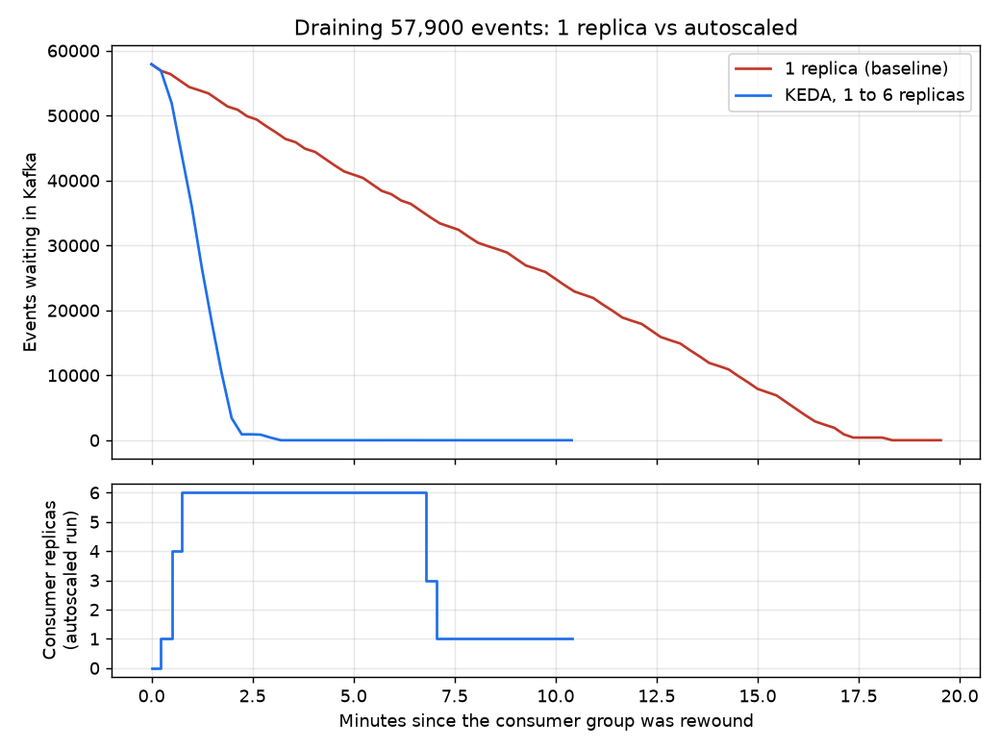

# Load test: draining a 57,900-event backlog, with and without autoscaling

## Objective

Find out how fast the BigQuery consumer can work through a large backlog, whether KEDA scales it up and back down correctly, and what limits its speed.

The load is **real history replayed at full speed**, not simulated traffic. The pipeline's normal volume is about 12 events an hour; a replay is the only time it is ever busy.

## Setup

| | |
|---|---|
| Backlog | 57,897 to 57,910 events: every event of the three demand topics, from offset 0 |
| Kafka | 3 topics x 6 partitions (18 partitions). Events are keyed by report, zone and delivery date, so days spread across partitions |
| Consumer | One Deployment, consumer group `bq-sink`. Micro-batches of up to 500 events, or 60 seconds. Each batch is one load job plus two `MERGE` statements into BigQuery, and the Kafka offset is committed only after BigQuery has the data. Requests 25m CPU and 128 MiB. |
| Autoscaling | KEDA Kafka scaler: minimum 1, maximum 6 replicas, about 2,000 events of lag per replica |
| Data already in BigQuery | Yes, so every `MERGE` finds its rows already present and changes nothing (a replay, not a first load) |

## Method

`scripts/loadtest.sh` stops the consumer, rewinds the group to the start, **checks the rewind really happened** (the backlog must equal every event in Kafka), starts the consumer, and samples replicas and total lag every 10 seconds into a CSV under `loadtest/`. `src/loadtest/summary.py` turns each CSV into the numbers below, and `scripts/plot_loadtest.py` draws the chart.

- **Baseline:** KEDA paused and the Deployment pinned at 1 replica.
- **Scaled:** KEDA decides, and sampling continues for 7 minutes after the drain to watch the scale-in.

## Results

| | 1 replica | KEDA, 1 to 6 replicas |
|---|---|---|
| Events drained | 57,897 | 57,910 |
| **Time to drain** | **18 min 20 s** (1,100 s) | **3 min 12 s** (192 s) |
| Throughput | 52.6 events/s | 301.6 events/s |
| Peak replicas | 1 | 6 |
| First scale-up | n/a | at 30 s (4 replicas); 6 replicas at 45 s |
| Back to 1 replica | n/a | at 423 s, about 4 minutes after the backlog cleared |

**Speed-up: 5.7 times, from at most 6 times.** Each replica kept doing about 50 events a second, the same as the single baseline replica, so scaling was close to linear.

## What limits the speed

The consumer is **latency-bound, not throughput-bound.** Each batch of 500 events costs three BigQuery jobs (a load and two `MERGE` statements), and a batch takes about nine seconds, mostly waiting on BigQuery. Evidence:

- Six replicas gave 5.7 times the speed. If a shared limit had been reached (for example BigQuery's limit on how fast one table can change, which this project has met before), the curve would have flattened below six.
- An earlier replay with **one** consumer at batches of **5,000** events (the replay Job from the BigQuery weekend) drained 58,762 events in 152 seconds, about 390 events a second. That is faster than six replicas at 500 events per batch, with one pod, because it pays the fixed per-batch cost ten times less often.

So the cheapest speed-up is not more replicas but bigger batches. Autoscaling is the right tool for the *unpredictable* load, but the batch size is what sets the cost per event.

## What I would change

1. Raise the batch size (try 2,000 to 5,000) and re-run both tests. **I have not tested batch size together with autoscaling**, so I do not claim they multiply.
2. Move to the BigQuery Storage Write API, which removes the load job from every batch.
3. Tune scale-in. The consumer stayed at 6 replicas for about four minutes after the backlog cleared. In this mode, how long KEDA waits is decided by the Kubernetes autoscaler's own stabilisation window, so the `cooldownPeriod` set on the ScaledObject (and flagged as irrelevant by KEDA's own warning) has no effect. A shorter window would release the replicas sooner.
4. Alert on the thing that matters: lag per replica over time, not just total lag.

## Caveats

- **One run of each.** The numbers are measurements, not averages, and I would expect a few percent of variation.
- It was a **replay into tables that already held the data**, so no row was inserted or updated. A first-time load does more work per batch and would be slower.
- The first two attempts were **invalid and are not in the results.** The first started while the consumer was still catching up from an earlier load; the second tried to rewind the group while it was still active, and Kafka's tool printed an error and still exited with success. The script now verifies the rewind, refuses to start unless the consumer is caught up, and always un-pauses KEDA. A third, accidental drain also happened when a full disk broke the first valid attempt; it showed autoscaling working but was never recorded.
- Replica counts come from the Deployment's ready replicas, sampled every 10 seconds.
